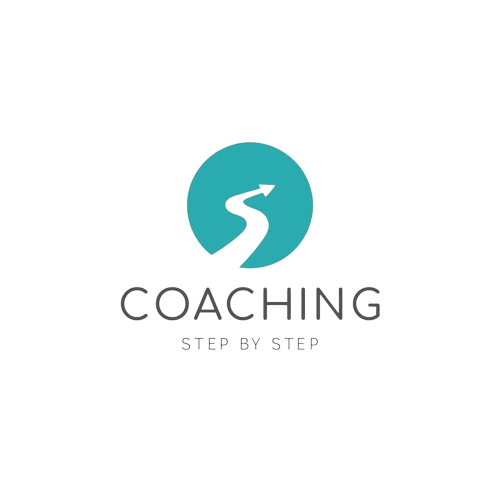
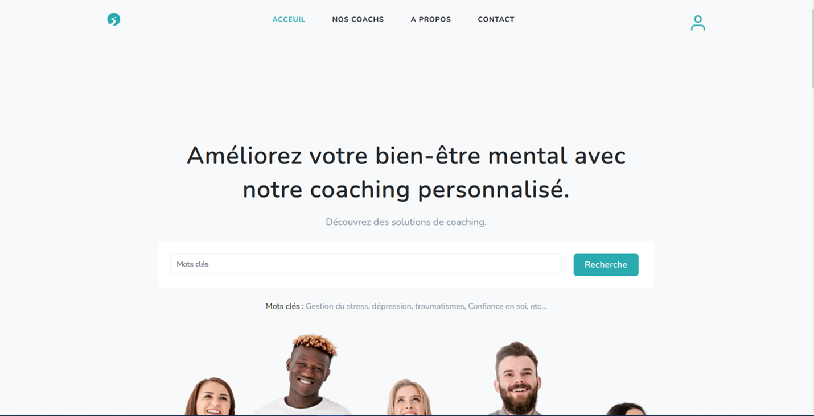
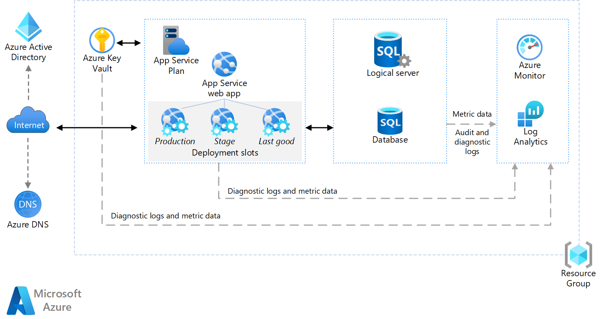

# E-coach-App
<div style="text-align: center;">



</div>

---
[]


E-coach-app is a web application for e-coaching, providing online coaching services. Our main objective was to create a user-friendly platform that allows users to find coaches tailored to their specific needs and benefit from remote coaching sessions.
# Table of Contents 
- [E-coach-App](#e-coach-app)
- [Table of Contents](#table-of-contents)
- [Screenshots](#screenshots)
- [Description](#description)
- [Installation](#installation)
- [Usage](#usage)
- [Architecture](#architecture)
- [License](#license)
- [Credits](#credits)
- [Contributing](#contributing)
# Screenshots
- Home Page
  
# Description
 We have developed an innovative web application for e-coaching, providing online coaching services. Our main objective was to create a user-friendly platform that allows users to find coaches tailored to their specific needs and benefit from remote coaching sessions.
The key features of our application include user registration, coach search and selection, coach-ing session booking, progress tracking, and review submission.
Our e-coaching application offers a user-friendly platform for coach search, selection, and ses-sion booking, as well as progress tracking and review submission. Through thoughtful design and the use of modern tools, we have created a robust application that meets the needs of users.

# Installation
E-coach-app requires php 7.4.3 or higher.
Install the dependencies and devDependencies and start the server.
Before you start the server, you need to create a database and import the db.sql file.
Then you need to create a .env file and copy the content of .env.example file and paste it in the .env file.
Then you need to change the database name, username and password in the .env file.
```sh
$ cd e-coach-app
$ composer install
$ php -S localhost:8000 -t public
```
# Usage
You can access the application by typing the following url in your browser: http://localhost:8000
# Architecture
 MVC

 Cloud

# License
This project is licensed under the MIT License - see the LICENSE.md file for details
# Credits
This project was developed by:
- [Julien AWON'GA](www.linkedin.com/in/julienaonga)
- [Tresor ADOSSI](https://www.linkedin.com/in/tresor-adossi-0b1b3a1b0/)
- [Nisrine RANE](https://www.linkedin.com/in/nisrine-rane-9b1b3a1b0/)
- [Asmae EL BOUKHSSEMI](https://www.linkedin.com/in/asmae-el-boukhssimi-9b1b3a1b0/)
# Contributing
This project is open source. Feel free to contribute to its development by forking it.

